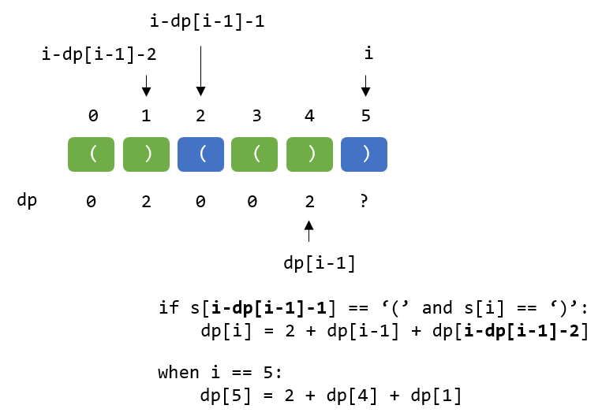

## 最长有效括号
<!--START_SECTION:badge-->


[](../../../README.md#困难)
[](../../../README.md#leetcode)
[](../../../README.md#动态规划)
[](../../../README.md#栈队列)
[](../../../README.md#leetcode-hot-100)

<!--END_SECTION:badge-->
<!--info
tags: [动态规划, 栈, lc100]
source: LeetCode
level: 困难
number: '0032'
name: 最长有效括号
companies: []
-->

> 

<summary><b>问题简述</b></summary>

```txt
给你一个只包含 '(' 和 ')' 的字符串，找出最长有效（格式正确且连续）括号子串的长度。
```

<!-- 
<details><summary><b>详细描述</b></summary>

```txt
```

</details>
-->

<!-- <div align="center"></div> -->

<summary><b>思路 1：动态规划（推荐）</b></summary>

- `dp[i] = 2 + dp[i−1] + dp[i−dp[i−1]−2]`，说明见下图：
    
    <div align="center"></div>

    > 时刻注意数组下标的有效性，即 `i-1 >= 0 and i−dp[i−1]−2 >= 0`

<details><summary><b>Python（迭代，推荐）</b></summary>

```python
class Solution:
    def longestValidParentheses(self, s: str) -> int:
        if not s: return 0

        dp = [0] * len(s)
        for i in range(len(s)):
            if i >= 1 and i - dp[i-1] - 1 >= 0 and s[i - dp[i-1] - 1] == '(' and s[i] == ')':
                dp[i] = 2 + dp[i-1] + dp[i - dp[i-1] - 2]
        
        return max(dp)
```

</details>

<details><summary><b>Python（递归）</b></summary>

```python
class Solution:
    def longestValidParentheses(self, s: str) -> int:
        
        from functools import lru_cache

        ret = [0]

        @lru_cache(maxsize=None)
        def dfs(i):  # s[i] 结尾的最长有效括号
            if i <= 0: return 0

            if i - dfs(i - 1) - 1 >= 0 and s[i - dfs(i - 1) - 1] == '(' and s[i] == ')':
                r = 2 + dfs(i - 1) + dfs(i - dfs(i - 1) - 2)
                ret[0] = max(ret[0], r)
                return r
            else:
                return 0
        
        dfs(len(s) - 1)
        return ret[0]
```

</details>

<summary><b>思路 2：栈</b></summary>

- 技巧性很强的方法，临场可能很难写出来，详见：[最长有效括号（方法 2） - 力扣官方题解](https://leetcode.cn/problems/longest-valid-parentheses/solution/zui-chang-you-xiao-gua-hao-by-leetcode-solution/)
