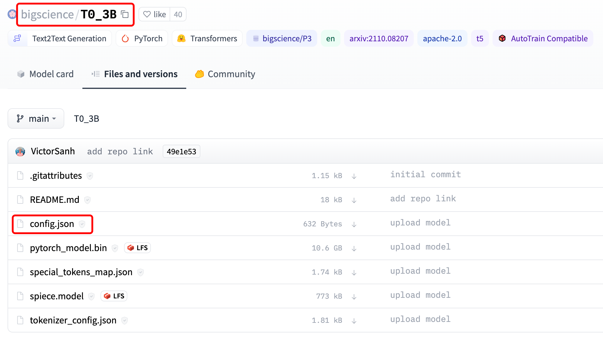

HuggingFace 套件离线使用方法
===
<!--START_SECTION:badge-->


<!--END_SECTION:badge-->

- HuggingFace 相关套件首次使用默认会从网络下载相关资源，导致在离线环境下无法使用；

## 方法

### 提前下载文件

- 法1）手动下载文件
    <div align="center"></div>
- 法2）使用 `huggingface_hub` 库下载；
    ```shell
    $ pip install huggingface_hub
    ```
    ```python
    from huggingface_hub import hf_hub_download

    hf_hub_download(repo_id="bigscience/T0_3B", filename="config.json", cache_dir="./your/path/bigscience_t0")
    ```
    <div align="center"></div>
- 法3）在联网环境使用 `.from_pretrained()` 下载，然后使用 `.save_pretrained()` 保存；
    ```python
    from transformers import AutoConfig, AutoTokenizer, AutoModelForSeq2SeqLM

    model_name = r'facebook/muppet-roberta-base'
    save_dir = r'./your/path/muppet-roberta-base'

    # download
    model = AutoModel.from_pretrained(model_name)
    config = AutoConfig.from_pretrained(model_name)
    tokenizer = AutoTokenizer.from_pretrained(model_name)

    # save
    model.save_pretrained(save_dir)
    config.save_pretrained(save_dir)
    tokenizer.save_pretrained(save_dir)

    # reload
    model = AutoModel.from_pretrained(save_dir)
    config = AutoConfig.from_pretrained(save_dir)
    tokenizer = AutoTokenizer.from_pretrained(save_dir)
    ```

### 设置离线环境变量

#### 脚本内
```python
import os

os.environ['TRANSFORMERS_OFFLINE'] = '1'  # 模型
os.environ['HF_DATASETS_OFFLINE'] = '1'  # 数据
```

#### CLI 模式
- 在调用脚本前添加离线环境变量 
    - 模型：`TRANSFORMERS_OFFLINE=1`；
    - 数据：`HF_DATASETS_OFFLINE=1`
```shell
$ HF_DATASETS_OFFLINE=1 TRANSFORMERS_OFFLINE=1 python examples/pytorch/translation/run_translation.py --model_name_or_path t5-small --dataset_name wmt16 --dataset_config ro-en ...
```


## 参考
- [Installation - Offline mode](https://huggingface.co/docs/transformers/v4.19.2/en/installation#offline-mode)