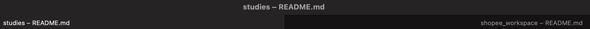

PyCharm 常用配置
===

- [常用配置](#常用配置)
    - [禁止 import 折叠](#禁止-import-折叠)
    - [修改 Docstring 风格](#修改-docstring-风格)
    - [快捷键修改](#快捷键修改)
    - [启用代码兼容性检查](#启用代码兼容性检查)
- [代码模板](#代码模板)
    - [Python](#python)
    - [Python Console](#python-console)
    - [自动补全（Live Templates）](#自动补全live-templates)
- [常用插件](#常用插件)
    - [主题](#主题)
    - [键位映射](#键位映射)
- [FAQ](#faq)
    - [【Mac】全屏模式下打开新项目默认在新 Tab 而不是新窗口](#mac全屏模式下打开新项目默认在新-tab-而不是新窗口)

---

## 常用配置

### 禁止 import 折叠
> Code Folding -> Imports

### 修改 Docstring 风格
> Docstring format -> Google

### 快捷键修改
- 安装插件：Plugins -> Marketplace -> Eclipse Keymap
- [常用快捷键](./快捷键记录.md#pycharm)

### 启用代码兼容性检查
> Preferences | Editor | Inspections -> Code is incompatible with specific Python versions


## 代码模板

### Python
> Preferences | Editor | File and Code Templates -> Python Script

- 更多内置变量详见：[File template variables | PyCharm](https://www.jetbrains.com/help/pycharm/file-template-variables.html)
```python
#!/usr/bin/env python
# -*- coding: utf-8 -*-
"""
#set( $author = "huayang" )
#set( $email = "imhuay@163.com" )
Time:
    ${YEAR}-${MONTH}-${DAY} ${TIME}
Author:
    $author ($email)
Subject:
    ${NAME}
"""
from __future__ import annotations

# import os
# import sys
# import json
# import unittest

# from typing import *
# from pathlib import Path
# from collections import defaultdict


class __Test:

    def __init__(self):
        import time
        from typing import Callable
        
        for k, v in self.__class__.__dict__.items():
            if k.startswith('_test') and isinstance(v, Callable):
                print(f'\x1b[32m=== Start "{k}" {{\x1b[0m')
                start = time.time()
                v(self)
                print(f'\x1b[32m}} End "{k}" - Spend {time.time() - start:3f}s===\x1b[0m\n')

    def _test_doctest(self):  # noqa
        import doctest
        doctest.testmod()

    def _test_xxx(self):  # noqa
        pass


if __name__ == '__main__':
    """"""
    __Test()
```

### Python Console
> Python Console

```shell
%load_ext autoreload
%autoreload 2

import os
import sys

print('Python %s on %s' % (sys.version, sys.platform))
sys.path.extend([WORKING_DIR_AND_PYTHON_PATHS])

# import numpy as np

# import torch
# import torch.nn as nn
# import torch.nn.functional as F
```

### 自动补全（Live Templates）
> Preferences | Editor | Live Templates -> Python

- 将 `super()` 的自动补全修改为 Python3 模式
    ```python
    # py2
    super($class$, self).$method$($end$)
    # py3
    super().$method$($end$)
    ```


## 常用插件

### 主题
- [Dracula Theme](https://plugins.jetbrains.com/plugin/12275-dracula-theme)（推荐）
- [One Dark theme](https://plugins.jetbrains.com/plugin/11938-one-dark-theme)


### 键位映射
- [Eclipse Keymap](https://plugins.jetbrains.com/plugin/12559-eclipse-keymap)


## FAQ

### 【Mac】全屏模式下打开新项目默认在新 Tab 而不是新窗口
- **问题描述**：在全屏模式下打开新项目，默认在当前窗口的 Tab 页打开，而不是新窗口；这个问题不是因为 PyCharm 导致的，而是 Mac 的设置；
    <div align="center"></div>
- **解决方法**：`系统偏好设置 -> 通用 -> 首选以标签页方式打开文稿` 改为 `永不`；
    <div align="center"></div>
