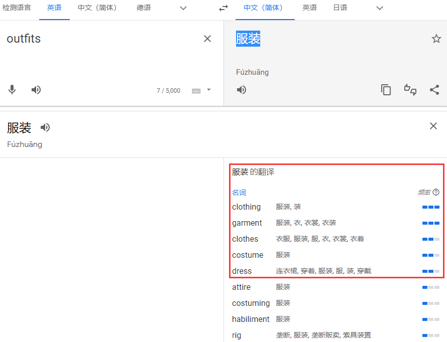

同义词挖掘
===
<!--START_SECTION:badge-->

<!--END_SECTION:badge-->
<!--info
top: false
hidden: false
-->

> ***Keywords**: synonym/synonymy/synonymous/aliase extraction(抽取)/detection(检测)/discovery(发现)/identification(识别)/generation(生成)*

<!--START_SECTION:toc-->
- [同义词挖掘的一般流程](#同义词挖掘的一般流程)
    - [无监督](#无监督)
    - [有监督](#有监督)
- [相似函数](#相似函数)
    - [ClickSim](#clicksim)
    - [DocSim](#docsim)
    - [PseudoDocSim](#pseudodocsim)
    - [QCSim](#qcsim)
- [同义词候选挖掘](#同义词候选挖掘)
    - [基于用户行为数据](#基于用户行为数据)
        - [Q2Q](#q2q)
    - [利用回译](#利用回译)
- [同义词判别](#同义词判别)
- [相关论文](#相关论文)
- [参考资料](#参考资料)
    - [论文](#论文)
    - [博客](#博客)
    - [资源](#资源)
<!--END_SECTION:toc-->
<!-- > [*References*](#References) -->

## 同义词挖掘的一般流程

### 无监督
> 本文重点
1. 生成同义词候选;
    1. 情况1) 给定了标准名与对应实体, 去挖掘其同义词合集[^2012,Chakrabarti];
    2. 情况2) 从给定语料中不定向挖掘同义词对[^2019,Mandal];
    > 这两种情况一般都可以通过一些共现行为 (如点击) 统一到相同的形式, 即对候选 pair 的判断;
2. 构造一个或多个相似性函数 (及其所需特征) 判断是否存在同义关系;

### 有监督
> 适用于大部分关系判断, 如上下位等;
1. 生成同义词候选;
2. 构造训练集, 训练模型, 预测;
    > 一般情况下, 如果资源充足, 都会从无监督逐渐过渡到有监督; 

## 相似函数

### ClickSim
> Click Similarity[^2011,Cheng]

### DocSim
> Document Similarity[^2001,Turney]

### PseudoDocSim
> 

### QCSim

## 同义词候选挖掘

### 基于用户行为数据
> 利用用户行为数据 (user behavioral data) 从查询词 (search query) 和搜索结果页 (search result pages, SRPs) 中挖掘同义词;

#### Q2Q
> Query to Query

- 基于同一用户的 session 生成一些列 query pairs;

### 利用回译

## 同义词判别
> 判断一对同义词是否满足要求

## 相关论文
- Mandal, Aritra, Ishita K. Khan, and Prathyusha Senthil Kumar. "Query Rewriting using Automatic Synonym Extraction for E-commerce Search." eCOM@ SIGIR. 2019.
- Lu, Hanqing, et al. "Unsupervised Synonym Extraction for Document Enhancement in E-commerce Search." (2021).

## 参考资料

### 论文

- [(2012,Chakrabarti) A Framework for Robust Discovery of Entity Synonyms](https://dl.acm.org/doi/10.1145/2339530.2339743)
    > 微软; 实体同义词 (entity synonyms); 基于点击数据; 垂类搜索领域 (电商/视频); 如何在垂搜中使用同义词;   
    > 提出 **Pseudo Document Similarity** (PseudoDocSim, 改进 ClickSim 和 DocSim) 和 **Query Context Similarit** (QCSim, 弥补 ClickSim 和 DocSim 的缺陷) 两种相似度计算方法;
- [(2011,Cheng) Entity Synonyms for Structured Web Search](https://ieeexplore.ieee.org/abstract/document/5963679)
    > 微软; Click Similarity (ClickSim)
    - Cheng T, Lauw H W, Paparizos S. Fuzzy matching of web queries to structured data\[C]//2010 IEEE 26th International Conference on Data Engineering (ICDE 2010). IEEE, 2010: 713-716.
        > 最早提出 ClickSim 的论文;
- [(2001,Turney) Mining the Web for Synonyms: PMI-IR versus LSA on TOEFL](https://link.springer.com/chapter/10.1007/3-540-44795-4_42)
    > Document Similarity (DocSim)

### 博客
- [How to Build a Smart Synonyms Model | by Patrick O'Neill | Kensho Blog](https://blog.kensho.com/how-to-build-a-smart-synonyms-model-1d525971a4ee)
    > 基于 Wikipedia 重定向挖掘同义词; 有 Kaggle 代码; 
    - [kdwd_aliases_and_disambiguation | Kaggle](https://www.kaggle.com/code/kenshoresearch/kdwd-aliases-and-disambiguation#Disambiguation-candidate-examples)
        > 关联的 Kaggle 代码; 
        - [Kensho Derived Wikimedia Dataset | Kaggle](https://www.kaggle.com/datasets/kenshoresearch/kensho-derived-wikimedia-data)
            > 关联的 Wikipedia 数据
    - [Introducing the Kensho Derived Wikimedia Dataset | by Gabriel Altay | Kensho Blog](https://blog.kensho.com/announcing-the-kensho-derived-wikimedia-dataset-5d1197d72bcf)
        > Wikipedia 数据解析方法; 介绍如何将原始 Wikipedia 数据解析成 Kensho 版本的数据; 有 Kaggle 代码; 

### 资源
- [smallwat3r/synonym: CLI tool to find synonyms in 15 different languages.](https://github.com/smallwat3r/synonym)
    > 一个 Linux 命令行工具, 通过调用 [Thesaurus](https://thesaurus.altervista.org/) 提供的 API 返回同义词;

<!-- omit in toc -->
### References

[^2012,Chakrabarti]: [(2012,Chakrabarti) A Framework for Robust Discovery of Entity Synonyms](https://dl.acm.org/doi/10.1145/2339530.2339743)
[^2011,Cheng]: [(2011,Cheng) Entity Synonyms for Structured Web Search](https://ieeexplore.ieee.org/abstract/document/5963679)
[^2001,Turney]: [(2001,Turney) Mining the Web for Synonyms: PMI-IR versus LSA on TOEFL](https://link.springer.com/chapter/10.1007/3-540-44795-4_42)
[^2019,Mandal]: [(2019,Mandal) Query Rewriting using Automatic Synonym Extraction for E-commerce Search](https://ir.webis.de/anthology/2019.sigirconf_workshop-2019ecom.18)
