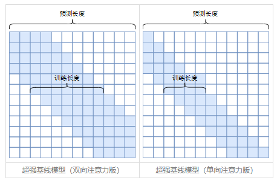

Transformer与长度外推性
===
<!--START_SECTION:badge-->


<!--END_SECTION:badge-->
<!--info
top: false
hidden: true
-->

> ***Keywords**: Transformer, 长度外推性(Length Extrapolation/Extrapolatable )*

<!--START_SECTION:toc-->
- [背景](#背景)
- [解决方案](#解决方案)
    - [局部注意力](#局部注意力)
    - [随机位置](#随机位置)
    - [`logN` 注意力](#logn-注意力)
- [References](#references)
<!--END_SECTION:toc-->


## 背景
- **长度外推性**: 指在短序列上训练的模型，能否在不进行微调的情况下推广到长序列上。
- 需要进行长度外推的主要原因是**训练和预测不一致**，具体有两点：
    1. 预测时使用了没训练过的位置编码；
    2. 预测时 attention 处理的 token 数量超过了训练时的数量；

## 解决方案

### 局部注意力
- **注意力局部化**，简单来说就是在计算 attention 矩阵时，限制每个位置能接收的上下文（加上一个 attention mask 矩阵），这是目前主流的方法。
    > ALiBi, KERPLE, Sandwich, xPos
    <div align="center"></div>

### 随机位置
> [Randomized Positional Encodings Boost Length Generalization of Transformers | OpenReview](https://openreview.net/forum?id=nMYj4argap)
- 训练时采用随机位置，仅保证位置间的相对顺序，参考如下代码：
    ```python
    def random_position_ids(N, L=2048):
        """从[0, L)中随机不重复挑N个整数，并从小到大排列"""
        return np.sort(np.random.permutation(L)[:N])
    ```

### `logN` 注意力
> [从熵不变性看Attention的Scale操作 - 科学空间|Scientific Spaces](https://kexue.fm/archives/8823)

- 即将 $Attention(Q,K,V)=softmax\left(\frac{QK^⊤}{\sqrt{d}}\right)V$ 修改为
    $$ Attention(Q,K,V)=softmax\left(\frac{\log_mn}{\sqrt{d}}QK^⊤ \right)V
    $$
    或
    $$ Attention(Q,K,V)=softmax\left(\frac{κ\log n}{d}QK^⊤ \right)V
    $$
    > 其中 $m$ 为**训练长度**，$n$ 为**预测长度**；这两个值可以根据具体任务使用常量，或引入超参数 $κ$；


## References
1. [Transformer升级之路：7、长度外推性与局部注意力 - 科学空间|Scientific Spaces](https://kexue.fm/archives/9431)
2. [Transformer升级之路：8、长度外推性与位置鲁棒性 - 科学空间|Scientific Spaces](https://kexue.fm/archives/9444)